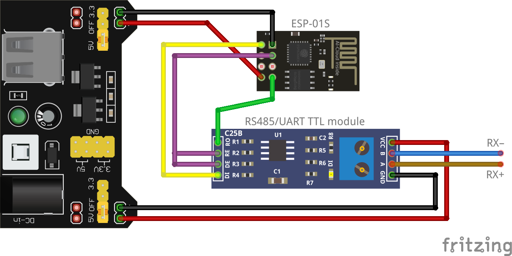

# ESP8266-based RS485/UDP converter



## Parts
* ESP8266 module (ESP-01, ESP-01S, NodeMCU etc.)
* RS485/UART TTL module
* 5V power supply
* jumper wires

## Assembly
1. Connect VCC and GND pins of ESP8266 module to power supply.
2. Connect VCC and GND pins of RS485/UART TTL module to power supply.
3. Connect ESP8266's RX pin to RS485/UART TTL module's RO pin.
4. Connect ESP8266's TX pin to RS485/UART TTL module's DI pin.
5. Connect ESP8266's IO2 pin to RS485/UART TTL module's DE and RE pins.
6. Connect RS485 A (RX+) and B (RX-) to RS485/UART TTL module A and B pins.

## Requirements
* [Arduino IDE](https://www.arduino.cc/en/Main/Software)
* [ESP8266 Arduino core](https://github.com/esp8266/Arduino) (esp8266 by ESP8266 Community installed in board manager)

## Configuration
You may either connect all ESP8266 modules to an existing 2.4 GHz Wi-Fi network or choose one module to serve as an access point (AP) to create new Wi-Fi network.

The access point should be programmed with the following configuration:
```cpp
#define STASSID "your-ssid"
#define STAPSK "your-password"
#define AP // enable access point mode
```

The remaining ESP8266 modules should use the configuration:
```cpp
#define STASSID "your-ssid"
#define STAPSK "your-password"
// #define AP // this line should be commented or removed
```

### IP address and port
By default, UDP multicast packets use IP address `224.1.2.3` and port `8888`. You may customize the IP address and port by modifying the following lines:
```cpp
IPAddress ipAddressMulticast(224, 1, 2, 3);
uint16_t port = 8888;
```

### Baudrate
By default, baudrate 9600 is used. You may change the baudrate by modifying the following line:
```cpp
Serial.begin(9600);
```

After reading all available bytes from serial buffer, the device waits for a short period of time for next bytes in order to prevent messages from being divided into multiple UDP packets. The delay of 4 milliseconds was determined experimentally. This value may differ for other baudrates.
```cpp
char *ptr = packetBuffer;
while (Serial.available()) {
  while (Serial.available()) {
    *ptr++ = Serial.read();
  }
  delay(4); // for 9600 baudrate
}
```

## Notes
* Connect IO0 pin to GND on power-up in order to set ESP8266 to programming mode.
* Enable pin should be connected to IO2, because it is turned low during startup (while IO0 is high).
* ESP8266 modules support only 2.4 GHz Wi-Fi.
* UDP is unreliable – some packets might get lost along the way (see [UDP](https://en.wikipedia.org/wiki/User_Datagram_Protocol)).
* Some routers/switches pass UDP multicast packets only to subscription group members (see [IGMP](https://en.wikipedia.org/wiki/Internet_Group_Management_Protocol)).
